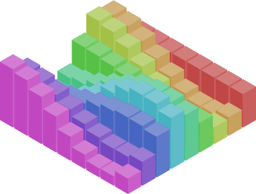

# purescript-isometric

An isometric drawing library for PureScript.

**Features**:
- Basic shapes: cube, prism, cylinder, cone, pyramid
- Extrusions from 2D paths
- Scaling, Translation, Rotation
- Depth sorting

[**Live demo**](http://sharkdp.github.io/purescript-isometric/)



## Build tests
```
bower install
pulp build -O -m Test.Main -I test -t html/main.js
```
Then, open `html/index.html` in a browser.
